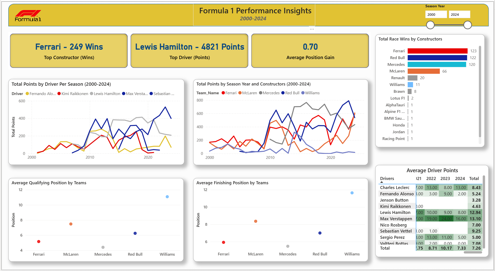

# F1 Data Analyst Project

Welcome to the **F1 Data Analyst Project** repository!
This project explores Formula 1 World Championship data from 2000 to 2024 using **Excel, SQL, and Power BI**.
The aim is to uncover insights into team performance, driver consistency, and race outcomes over time.

This portfolio project demonstrates **data cleaning, transformation, and analysis skills**, showcasing the ability to work with large real world datasets and draw meaningful conclusions through visualizations.
The goal of this project is to demonstrate end-to-end data analysis skills from raw data extraction to interactive visualization.

**Objectives**
-	Teams consistency and dominance over time 
-	Relationship between qualifying and finishing positions 
-	Race outcomes across seasons 
-	Year over year team performance improvement 

🧰 **Tools & Technologies**

-	Data Source: Kaggle Formula 1 Dataset
-	Data Cleaning: Microsoft Excel
-	Data Querying: SQL Server
-	Visualization: Power BI (Dashboard can be viewed in visual folder)
-	Languages Used: SQL, DAX

🧠 **Workflow**

Data Collection:

- Extracted raw Formula 1 data (drivers, constructors, races, results) from Kaggle - ([https://www.kaggle.com/datasets/rohanrao/formula-1-world-championship-1950-2024](https://www.kaggle.com/datasets/rohanrao/formula-1-world-championship-1950-2020)
  
Data Cleaning & Transformation (Excel):
- Replaced ‘\N’ values with blanks or appropriate text 
- Converted all date fields into ISO format (YYYY-MM-DD)
- Verified all column data types (numeric, text, date) before export.
- Standardized column names and merged relevant tables.
- Exported cleaned dataset as .csv files with MS-DOS encoding for smooth SQL import and saved Power Query transformation steps within excel workbook for reproductivity. 

SQL Querying:

- Calculated total wins, average finishing and qualifying positions, and driver points per season.
- Identified top constructors and drivers based on performance metrics.
  
Example:

These queries can be found in the SQL folder.

Data Visualization (Power BI) built an interactive dashboard to visualize:

- Top teams and drivers.
- Qualifying vs finishing position relationships.
- Points progression across seasons.
- Team consistency and dominance over time.
- Added slicers for Season Years

💡 **Key Insights**

- Qualifying position strongly predicts race outcome, showing a clear correlation between start and finish positions.

- Mercedes dominated between 2014–2020, reflecting their hybrid era success.

- Red Bull Racing now leads in total wins and shows strong consistency in recent seasons.

- Ferrari, Mercedes, and Red Bull have maintained similar total points since 2000, each with distinct peaks of dominance.

- Team performance variability decreased after 2010, suggesting greater competitiveness in recent seasons.

### Dashboard  

